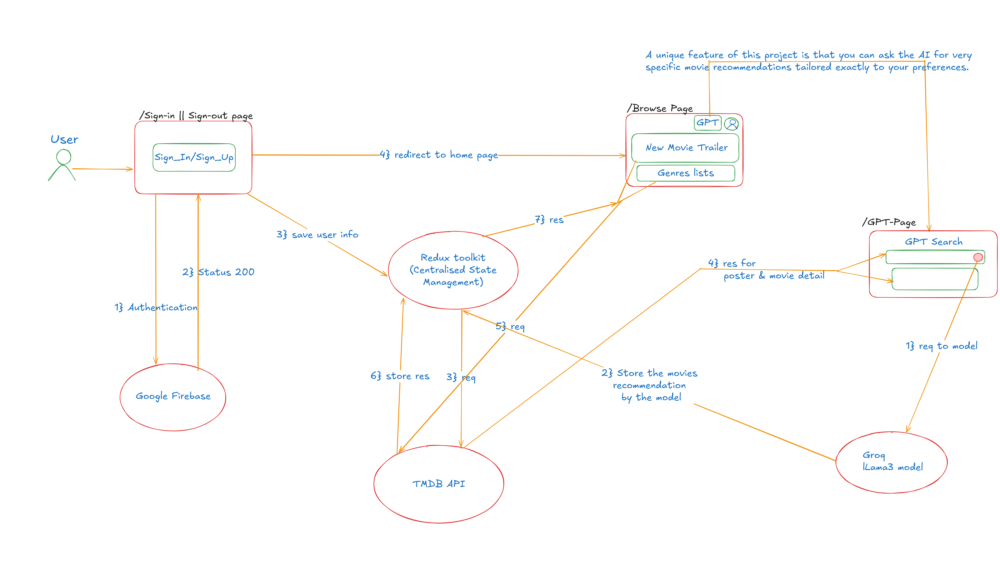

# 🎬 Netflix-GPT

A Netflix-themed application enhanced with **AI-powered movie recommendations** using **Groq LLaMA-3 model**. This project combines the familiar Netflix-like UI with cutting-edge AI to suggest movies tailored exactly to your preferences.

---

## 🔄 Project Flow

Here’s how the app works:



### **1. Authentication**

* User logs in or signs up via Firebase.
* Firebase authenticates and returns status.
* User info is saved in Redux store.

### **2. Browse Page**

* Shows new trailers and genre-based movie lists.
* Data is fetched from TMDB API and stored in Redux.

### **3. GPT Search Page**

* User types a query for very specific recommendations.
* Request goes to **Groq LLaMA-3 model**.
* Model returns results → stored in Redux.
* A follow-up request is sent to TMDB API for posters and movie details.
* Final movies are displayed beautifully on the page.

---

## 🚀 Features

* 🔑 **User Authentication** with Firebase (Sign-in / Sign-up / Logout).
* 🎥 **Latest Movie Trailers** powered by **TMDB API**.
* 📚 **Genre-wise Movie Lists** dynamically fetched from TMDB.
* 🤖 **AI-Powered Search (GPT Page)** – Ask AI for very specific movie recommendations beyond standard filters.
* 🗄️ **Centralized State Management** using Redux Toolkit.
* 🎨 **Modern UI/UX** styled with TailwindCSS.
* ⚡ Built with **React + Vite** for fast performance.

---

## 🛠️ Tech Stack

* **Frontend:** React, Vite, TailwindCSS
* **State Management:** Redux Toolkit
* **Authentication:** Firebase
* **API Integration:** TMDB API, Groq LLaMA-3 model
* **Build Tool:** Vite

---


## ⚙️ Installation & Setup

```bash
# Clone the repository
git clone https://github.com/yourusername/netflix-gpt.git

# Navigate into the project folder
cd netflix-gpt

# Install dependencies
npm install

# Start development server
npm run dev
```

---

## 🔑 Environment Variables

Create a `.env` file in the root with:

```env
VITE_FIREBASE_API_KEY=your_firebase_api_key
VITE_TMDB_API_KEY=your_tmdb_api_key
VITE_GROQ_API_KEY=your_groq_api_key
```

---

## 🎯 Unique Feature

Unlike Netflix, **Netflix-GPT lets you ask AI for very specific movie recommendations**, tailoring results exactly to your preferences.

---

Thank You!
